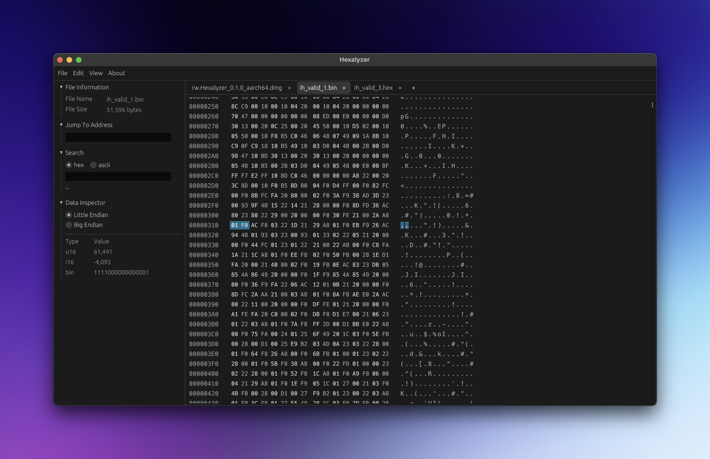

<div align="center">
  
  <h1>Hexalyzer</h1>
</div>

Hexalyzer is an app for inspecting and modifying firmware files and binary data.
Any hex or binary encoded file can technically be opened.

Hexalyzer project contains two main parts:
- A modern GUI application that can display and edit contents of HEX and BIN files.
- A standalone Intel HEX parsing library.




## Installation

Use [cargo packager](https://crates.io/crates/cargo-packager) to build an installer for your platform.

Go into hexalyzer directory `cd hexalyzer` and run:
1. `cargo build --release`
2. `cargo packager --release`

This will create `.exe` installer for Windows, and `.dmg` installer for
macOS. Linux was not tested but should work too.

When the tag is available, the installers will be attached.

### Notes for Windows

I had bunch of issues with generating Windows installer and the
final executable correctly. Before building, you need to run 
`cargo add --build winresource` which helps setup the icon on the
executable.

In addition, if you want to install the app in certain folders, e.g.,
`C:\Program Files\Hexalyzer`, you need to run the installer with
admin rights, the same goes for uninstalling.


## Usage

### Getting started

1. **Open a File**: Use the `File → Open File...` menu or drag and drop a `.hex` or `.bin` 
file into the main window.

2. **Navigate**: Use the scroll area to browse the data. The center panel displays the
hex values and their ASCII equivalents side-by-side. Use side panel to jump to a specific
hex address or search for a byte / ASCII value(s).

3. **Edit**: Click on a byte to edit its value. Changes are tracked and can be reverted
if needed.

4. **Inspect**: Use the side panel to see how the selected bytes are interpreted as
different data types (integers, floats, etc.). Multibyte selection is possible!

### Menu options

The top menubar provides access to the core file management and data transformation
tools:

#### File

1. `Open file...`: Browse your system to load a file into a new tab.
2. `Export file...`: Save your current session to a new file.
3. `Close file`: Close the current tab.

#### Edit

1. `Relocate...`: Relocate the current file to a new start address.
2. `Restore byte changes`: Discard all changes made to the current file.

#### View

Switch between displaying 16 or 32 bytes per row.

#### About

Displays version information and credits for the Hexalyzer project.


## Intel HEX Library

The core of Hexalyzer is powered by a standalone Intel HEX parsing library `intelhexlib`. It is designed to
handle memory-sparse firmware files using a BTreeMap buffer.

### Key Features

- **Sparse Data Support**: Uses `BTreeMap<usize, u8>` to store data, meaning files with large gaps 
between memory segments don't consume unnecessary RAM.

- **Data editing**: Allows updating single bytes, byte slices, and supports relocation to a new
start address.

- **Flexible API**: Allows for easy parsing and update of hex data as well as straightforward
integration into other projects.

### Usage Example

```rust
use hexalyzer::intelhex::IntelHex;
use std::path::PathBuf;

fn main() {
    // Load and parse a file
    let path = PathBuf::from("firmware.hex");
    if let Ok(mut ih) = IntelHex::from_hex(&path) {
        println!("Loaded {} bytes from {:?}", ih.size, ih.filepath);
        
        // Access data at a specific address
        let address: usize = 0x0800_0000;
        if let Some(byte) = ih.get_byte(address) {
            println!("Byte at {:X}: {:02X}", address, byte);
        }

        // Update data at a specific address
        let new_value = 0x0F;
        let res = ih.update_byte(address, new_value);
        if res.is_ok() {
            println!("Updated byte at {:X} to: {:02X}", address, new_value);
        } else {
            println!("Error during update: {:?}", res.unwrap_err().to_string())
        }

        // Iterate over contiguous segments
        // Since it uses a BTreeMap, keys are always sorted by address
        for (addr, byte) in ih.iter().take(10) {
            println!("{:X}: {:02X}", addr, byte);
        }
    }
}
```

### CLI

A CLI tool `hexcli` is also available for parsing and editing Intel HEX files.

Its functionality includes:
- Getting info about a file.
- Relocating the file to a new start address.
- Converting a file to between BIN and HEX formats.
- Merging multiple files into a single one (mixing BIN and HEX files is allowed).

```shell
 ----------------------------------------------------------------
|  Intel HEX Utility  | v0.1.0 - Copyright (c) 2026 Ihar Hlukhau |
 ----------------------------------------------------------------

Usage:
  hexcli info <input>
  hexcli relocate <input> <output> [options]
  hexcli convert <input> <output> [options]
  hexcli merge <output> <input1>[:addr] ... <inputN>[:addr]

Options:
  --address <val>    Base address for relocate / convert from BIN to HEX
  --gap-fill <val>   Byte to fill gaps when converting / merging to BIN (default: 0xFF)

Examples:
  hexcli info firmware.hex
  hexcli relocate firmware.hex firmware_shifted.hex --address 0x1000
  hexcli convert firmware.hex firmware.bin --gap-fill 0x00
  hexcli merge final.hex firmware1.hex firmware2.bin:0xFF00
```


## History

v0.1.0 (2026-01-14) - Initial Release


## Potential app improvements

### UX and performance improvements to the app

1. Per-frame allocations in the hex grid

- Issue: app creates 16/32 `Button`s + 16/32 `Label`s per row; each byte formats strings (`format!("{:02X}")`);
search, edits, etc. copy data around.

- Impact: hundreds of widgets and heap allocations per frame → high CPU pressure.

- Potential fix: render whole row as a single galley (`LayoutJob`) for hex and another for ASCII; detect
hovered/selected cell via math on mouse position instead of individual widgets.

2. BTreeMap lookups in a tight render loop

- Issue: `ui_centralpanel.rs` repeatedly calls `ih.get_byte(addr)` per cell (`BTreeMap::get` has O(log n) time
complexity).

- Impact: multiplied across all visible bytes each frame → wastes CPU.

- Fix: prefetch visible window once per frame into a small `Vec<Option<u8>>` and index into it.

3. Virtual scroll over (potentially huge) sparse ranges

- Issue: hex files can have address gaps, these gaps are displayed as empty rows.

- Impact: although it is used in some other hex viewer apps, it is not ideal for UX.

- Fix: compress gaps into a separator. The problem is that jump/search/etc offset calculations have to be
adjusted accordingly.

4. Tabs are hacky to say the least...


### Architectural weaknesses

1. Data representated as `BTreeMap<usize, u8>`

- Memory-heavy and slow for contiguous data. Typical firmware is largely contiguous; a byte-per-node map scales
poorly beyond ~100–300k bytes.

- Possible solution: represent data as contiguous segments `BTreeMap<usize, Vec<u8>>`, where key is the offset
(aka start address of the contiguous segment) and value is the data vector.

2. UI tightly couples rendering and model details

- HexSession owns data, selection, editing, search, and paints per-byte widgets directly. Harder to unit test, 
refactor and optimize.

- Possible solution: introduce a ViewModel layer: compute a lightweight "visible page" (bytes, ascii, selection
masks) separate from painting. The painter consumes this without hitting the data layer repeatedly.

3. Synchronous tasks on the main thread

- File load/save and potentially large searches run on the UI thread without the possibility to cancel.

- Possible solution: job system with background workers; add cancel and progress.

### Additional features

1. Make CLI for `intelhexlib`
2. Support Copy, Undo, Redo, etc.
3. Support ELF format
4. Show the current address of the selected byte
5. Add timestamp (time since epoch) type in the data inspector
6. Saving an entire app state / session?
